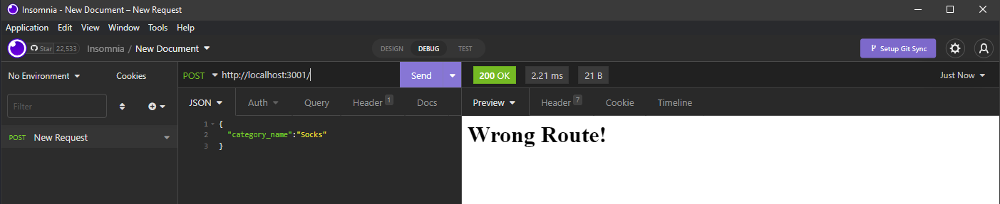
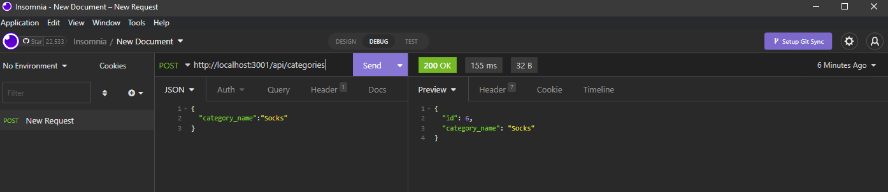

# Ecommerce-Backend-ORM

by Lisa Le

## Description

As a manager at an internet retail company, they will be able to use the latest technologies to help keep track and run their business. This app is a backend app that is designed for e-commerce websites to help keep track of stocks and prices.

## Acceptance Criteria

Given a functional Express.js API, the user will be able to create a database and add information about their e-commerce store. There will be an environment varible file for MYSQL user and password. Using sequelize, the user will be able to connect into the database and add and/or update various components online. User will be able to run AP on Insomnia Core , and they will be able to successfully create, update, and delete any data that was placed into the creted database.

## Techinques and Technology

    -Node.js
    -Express.js
    -MYSQL/MYSQL2
    -Sequelize
    -Dotenv
    -Insomnia Core

## Demo

## Screenshots

